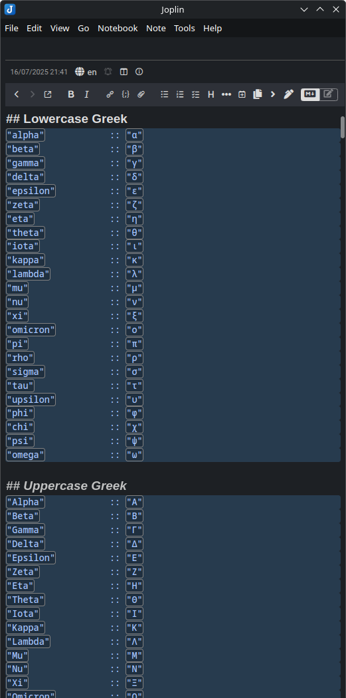
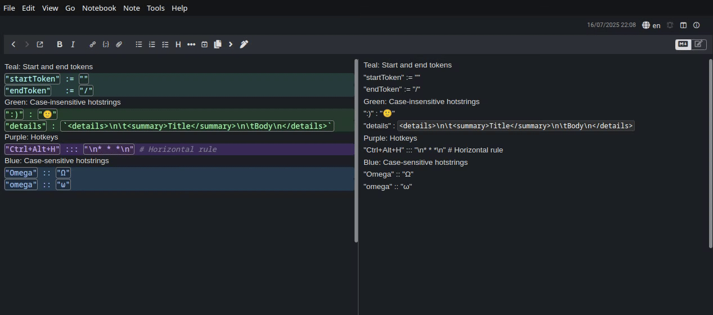
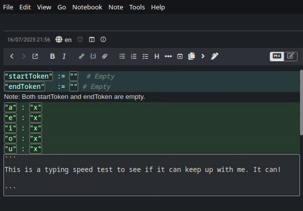
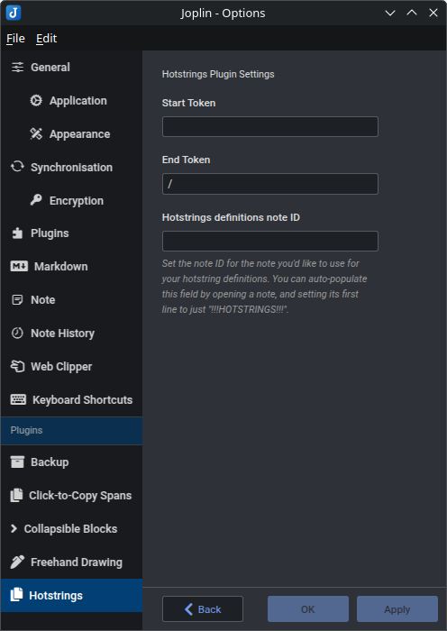

# Joplin Plugin - Hotstrings

This Joplin plugin allows you to create user-defined **hotstrings** and **hotkeys**. When a **hotstring** or **hotkey** is activated, it will replace or insert user-defined text. 

**Version**: 1.0.0

### Installation

- Open Joplin and navigate to `Preferences > Plugins`
- Search for `Hotstrings` and click install
- Restart Joplin

### Uninstall

- Open Joplin and navigate to `Tools > Options > Plugins`
- Find the `Hotstrings` plugin
- Press `Delete` to remove the plugin, or click the toggle to disable it
- Restart Joplin

## Usage

### Config note

In order to use this plugin, you must first select a note to act as the configuration file for this plugin. Any note can be used - even an existing one. To select a note, simply open it, and replace the first line of the note with the text `!!!HOTSTRINGS!!!` and nothing else. The first line will be replaced with a message noting the note has been claimed successfully. No other note content will be modified or deleted. 

If you prefer, you can also manually enter a note's ID into the plugin's settings page instead. The above process does this automatically. 

Once a note has been claimed, you can start defining **hotstrings** and **hotkeys** in it, which will then work in *any* note.

An in-note tutorial can be generated by replacing the first line of the config note with the text `!!!HOTSTRINGSTUTORIAL!!!` and nothing else. The tutorial is different from this documentation, but not substantially so. 

You can also preload about a thousand **hotstrings** to the end of your config note by writing `!!!PREFILLHOTSTRINGS!!!` (and nothing else) on the *last* line of the note. These preloaded **hotstrings** are pulled directly from another of my projects, not related to Joplin but available on my GitHub (and intended purely for personal use, so completely undocumented), which adds similar system-wide hotstring capability to Windows and Linux. 

### Hotstrings

To define a **hotstring**, open the plugin's claimed config note and, on a new line, enter text like this: 

```
"left" : "←"
```

And this will define a **hotstring** which, when activated, changes the text `left` to `←`. 

**Hotstrings** can be either case-insensitive or case-sensitive, depending on the number of colons between the trigger and replacement:
* Use one colon (:) for case-insensitive **hotstrings**
* Use two colons (::) for case-sensitive **hotstrings**

Example:
```
"Gamma" :: "Γ"
"theta" : "θ"
```

In this case:
* `Gamma` will only trigger for exactly `Gamma` (not `GAMMA` or `gamma`, etc)
* `theta` will trigger for any capitalization—`theta`, `Theta`, `THETA`, `thEtA`, etc.

You may optionally include Python- or JavaScript-style inline comments in your definitions, using `#` or `//`. 

```
":)" : "🙂" # Like this! 
":(" : "🙁" // Or this! 
```

You can also write whatever you want on lines which aren't attempting to define a **hotstring** or **hotkey**—lines which aren't valid definitions will simply be ignored. 

### Activation

The plugin's settings page defines two other strings in addition to the config note ID: The **start token** and **end token**. In order to "activate" a **hotstring**, you must type the **hotstring**, surrounded by its **start token** and **end token**. 

By default, the **start token** is empty, and the **end token** is `/`. So, if you've defined a hotstring for `:)`, you'd type `:)/` to activate it—after which the `:)/` will be replaced with "🙂" (or whatever output you defined). 

For example, you may want to define them both as `::`, or both as `/`, in which case you'd type `:::)::` or `/:)/`, respectively. Or you may even choose to make both empty - in which case the **hotstring** would activate after just `:)`. Do what feels natural to you. 

### Hotkeys

**Hotkeys** work just like **hotstrings**—except they're triggered by pressing a key combination, rather than by typing a **hotstring**. 

To define a **hotkey**, use three colons (:::) instead of one or two. On the left side, write the key combination desired, using `+` between each key

Examples:
```
"Ctrl + H" ::: "\n* * *\n" # Horizontal rule
"control + Alt + d" ::: "<details>\n\t<summary>Title</summary>\n\tBody\n</details>" # Collapsible <details> block
"shift+K" ::: "oala" // Any time you write K, it writes Koala ¯\_(ツ)_/¯
```

The syntax on the left is intentionally forgiving—you can use or skip spaces, and many keys accept multiple accepted names or spellings. For example, `Ctrl` and `Control` are interchangeable. If you want to include a literal space in your **hotkey**, use the word `Space`. Capitalization does not matter in key names at all. 

**Hotkeys** can consist of any combination (including none) of `Ctrl`, `Alt`, and `Shift`, and then *must* include *exactly one* of any other key. Most keys are supported. 

Note: Due to a [bug](https://discourse.joplinapp.org/t/bug-inconsistent-modifier-key-validation-renders-meta-super-unusable-in-keyboard-shortcuts-on-linux/29656) in Joplin, you cannot use the Windows/Meta/Super key in **hotkeys**, as it causes an unrecoverable crash in some situations. 

### Limitations
* **Hotkeys** cannot distinguish between left and right modifier keys. There is no `CTRL_L` or `CTRL_R`—only `CTRL`, etc. 
* **Hotstring** definitions (left-side triggers) cannot contain newlines.
	* However, text replacements (right-side outputs) **can** contain newlines and tabs. If you type `\n` or `\t` in your replacement string, it will be rendered as a literal newline or tab character, respectively. 
*  When you add or change **hotkeys**, the plugin must create menu items for them - you may see them appear in the Tools menu. Due to limitations with the Joplin API, commands can't be removed without restarting Joplin - so, since the plugin updates live as you make edits to this document, the Tools menu may fill with extra commands. This is **temporary** and **cosmetic**, and all the extraneous commands and menus will disappear the next time Joplin is restarted.
*  **Hotstrings** and **hotkeys** only work in the markdown editor - the rich text editor is not supported. 

### Tokens

As a convenience, you can also set the **start token** and **end token** directly from the config note, rather than from the plugin settings page. To do so, use the following format: 

```
"startToken" := "" # Empty
"endToken" := "/"
```

### Colors

In the config note, successfully parsed lines are highlighted in different colors and rendered in a monospace font, in order to make it clear exactly how the plugin is interpreting your definitions. You may see the following colors: 

* Green: Successfully parsed case-insensitive **hotstring**.
* Blue: Successfully parsed case-sensitive **hotstring**.
* Purple: Successfully parsed **hotkey**.
* Teal: Successfully parsed **token**.
* Red: **Hotkey** or **token** which is in the correct format, but contains an invalid left side (e.g., for **hotkeys**, too many or too few non-modifier keys, unknown keys, or the super key; for **tokens**, anything but `startToken` and `endToken`).
* Yellow: A valid **hotstring**, **hotkey**, or **token** definition that has been ignored because a definition further down in the config overrides it with the same left-side trigger.
* Grey: Comments.
* No color: Lines the plugin failed to recognize as valid definitions.

### Formatting

The plugin is quite flexible with formatting in the config note. Definitions may include any amount of whitespace in any location outside the quotes, except between colons. 

You can use double quotes ("), single quotes ('), or backtick quotes (`) when defining strings.

There's no requirement that the config file only contain definitions, or that it must contain anything at all. Feel free to fill it with non-definition lines which explain different sections. Even this README could be a valid config note. 

## Screenshots

Note that, although all screenshots are taken from the hotstrings config note, hotstrings work in *any* note. 

A sample of the (optional) 1000+ built-in hotstrings


A demo of two case-insensitive hotstrings, a hotkey, and two case-sensitive hotstrings


A typing test - can the plugin keep up with full typing speed?


## Settings
There is a settings page for the plugin in the Joplin options. There, you can:
* Change the **start token** and **end token**
* Manually set the note ID of the plugin's config note



Note that all of these settings can also be set from the config note itself. 

## Troubleshooting
If a **hotkey** isn't working, even though the config note's coloration indicates it was successfully parsed, it may be because the **hotkey** is already in use by Joplin or your operating system. This plugin does not verify if a **hotkey** is actually free to use—only that it's formatted correctly. The plugin will attempt to register the **hotkey** and, if it's already in use by Joplin for something else, it will silently fail.

You can check which hotkeys are reserved by Joplin in `Tools → Options → Keyboard Shortcuts`. 

If a **hotkey** seems like it should be accepted, but it's showing up in red, you may be using an invalid key. For example, the **hotkey** `Ctrl+Alt+!` would not be valid because `!` (on most keyboard layouts) is typed as `Shift + 1`. A valid equivalent **hotkey** would therefore be `Ctrl+Alt+Shift+1`. Any key which requires the use of `shift` cannot appear in a **hotkey** definition. 

## Issues

- **Encounter any bugs?** [Report them here](https://github.com/ntczkjfg/joplin-plugin-hotstrings/issues), and I'll do my best to fix them.

## Other plugins

Check out my other plugins:
* [Click-to-Copy Spans](https://github.com/ntczkjfg/joplin-plugin-click-to-copy-span)! Easily create spans of text that, when clicked, are automatically copied to your clipboard for fast and easy pasting. 
* [Collapsible Blocks](https://github.com/ntczkjfg/joplin-plugin-collapsible-block)! Easily create collapsible/foldable blocks that can hide their content from view. 
